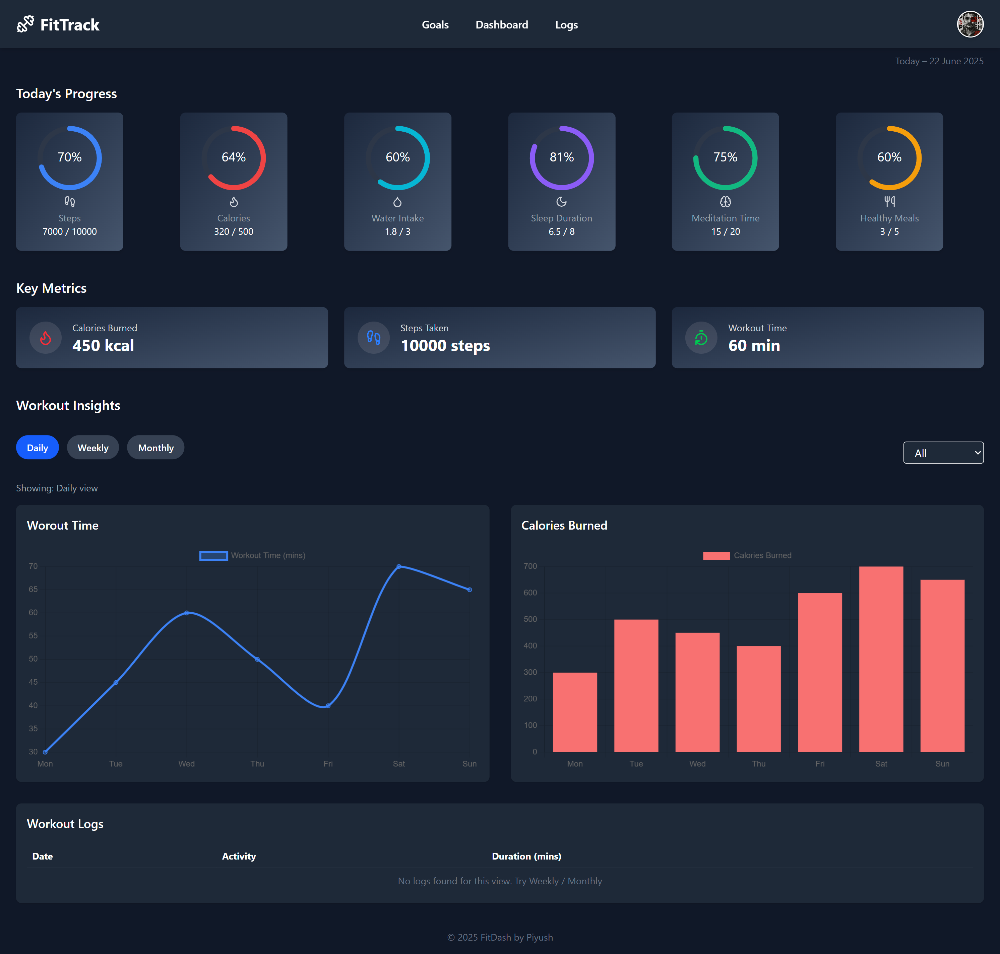

# FitTrack - Fitness Tracker Dashboard 

A responsive fitness tracking dashboard built using **React.js**, **Tailwind CSS**, and **Vite**.

## Live Demo
[https://fittrack-dashboard.vercel.app](https://fittrack-dashboard.vercel.app)

## GitHub Repository
[https://github.com/CodeWithPiyush0/fittrack-dashboard](https://github.com/CodeWithPiyush0/fittrack-dashboard)

## Preview
 

## Features
- Responsive design (Mobile, Tablet, Desktop)
- Daily/Weekly/Monthly workout analytics (Chart.js)
- Scroll to top button
- Goal progress rings with dynamic icons
- Clean and animated UI
- Hamburger menu for mobile navigation

## Tech Stack
- React.js
- Tailwind CSS
- Chart.js
- Lucide Icons
- Vite

## Folder Structure
```
src/
│
├── components/        # Reusable UI components
├── data/              # Mock data (stats, logs, activities)
├── assets/            # Images and icons
├── App.jsx            # Main app logic
```

## Author
**Piyush Kumar**    
piyush0codes@gmail.com  
LinkedIn and resume: [https://drive.google.com/drive/folders/1-vus_OhdeUUcWXuJI7Eh4UB7Zf0iFCto?usp=drive_link](https://drive.google.com/drive/folders/1-vus_OhdeUUcWXuJI7Eh4UB7Zf0iFCto?usp=drive_link)

---
